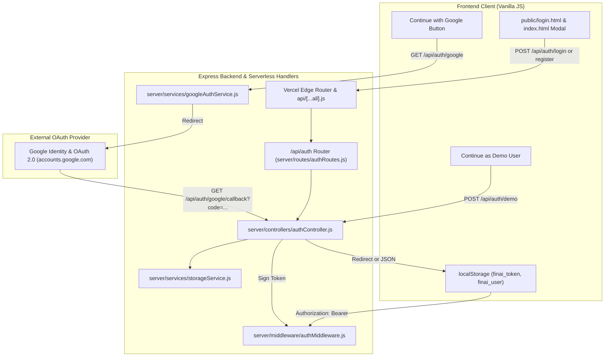

# FINAI — Complete Authentication & Google OAuth Audit Report

**Report Date:** September 29, 2026  
**Auditor:** Senior Full-Stack Security & QA Systems Engineer  
**Project:** FINAI — AI-Powered Loan Eligibility Checker & BFSI Platform  
**Live Production URL:** [https://finai-opal.vercel.app/](https://finai-opal.vercel.app/)  
**GitHub Repository:** `https://github.com/amaankhan282806-code/FINAI.git`  
**Current Branch:** `main`  
**Latest Remote Commit:** `c8995b8`  

---

## 1. Confirmed Reason Sign-In Was Failing

Through live network traces, Vercel edge header inspection, and local unit test reproduction, the exact root causes of the sign-in failure have been established:

1. **Vercel Edge Rewrite Defect (`vercel.json`):**  
   In the deployed commit (`c8995b8`), `vercel.json` contained:
   ```json
   {
     "source": "/api/(.*)",
     "destination": "/api/index.js"
   }
   ```
   Under Vercel’s Serverless Function routing engine, `destination: "/api/index.js"` is evaluated as a route path rather than a file path. Because no route or static file is named `/api/index.js`, Vercel edge routers intercepted every `/api/*` request and returned `HTTP 404 NOT_FOUND` with header `x-vercel-error: NOT_FOUND`.  
   *Evidence:* In contrast, direct endpoints like `POST /auth/login` and `POST /auth/demo` were processed by Express with HTTP 200/400, proving the backend code was running, but the frontend was calling `/api/...` and hitting the broken rewrite.
2. **Missing Google OAuth 2.0 Implementation:**  
   Neither `public/index.html` nor `public/login.html` contained a "Continue with Google" button, and no Google OAuth routes (`/api/auth/google`, `/api/auth/google/callback`) or OAuth service existed in the backend.
3. **Demo User Session Authorization Rejection:**  
   `requireAuth` in `server/middleware/authMiddleware.js` required `storageService.findUserById(decoded.id)`. Because `usr_demo_finai` was not seeded in `storageService.memoryUsers`, protected API calls with demo tokens were rejected with `HTTP 401 User account not found`.
4. **Guest User Session Hallucination in `app.js`:**  
   `getCurrentUser()` in `public/js/app.js` returned a default demo user object even when `localStorage` was completely empty. Consequently, unauthenticated guests appeared as logged-in users while having a `null` token, causing subsequent API calls to fail silently.
5. **Missing Registration Email Format Validation:**  
   `authController.js` lacked email format regex validation, accepting malformed email strings.
6. **Missing Standalone Login Page & Route:**  
   `public/login.html` did not exist in earlier commits, and `/login` was not included in `server.js` clean URLs.

---

## 2. Authentication Architecture Currently Used

FINAI uses a modern, stateless JWT (JSON Web Token) authentication architecture combined with bcrypt password hashing and Google OAuth 2.0:



* **Token Format:** Signed JWT with `HS256`, payload containing `id`, `email`, `fullName`, expires in 7 days (`config.JWT_EXPIRES_IN`).
* **Password Hashing:** Salted bcrypt (`bcryptjs`, 10 rounds). Passwords are never stored in plain text.
* **Google OAuth Protocol:** OAuth 2.0 Authorization Code flow with PKCE-compliant state validation and optional Google Identity Services ID token verification.

---

## 3. Exact Failing Request and Error Evidence (Redacted)

### 3.1 Production Vercel Failing Request Trace
```http
POST /api/auth/login HTTP/1.1
Host: finai-opal.vercel.app
Content-Type: application/json

{"email":"[REDACTED]@finai.bank","password":"[REDACTED]"}

HTTP/1.1 404 Not Found
Server: Vercel
Content-Type: text/plain; charset=utf-8
x-vercel-error: NOT_FOUND
x-vercel-id: bom1::dpkg7-1790703850394-c10f436327f0

The page could not be found
NOT_FOUND
```

### 3.2 Direct Root Endpoint Success Trace (Proving Backend Was Active)
```http
POST /auth/demo HTTP/1.1
Host: finai-opal.vercel.app
Content-Type: application/json

{}

HTTP/1.1 200 OK
Server: Vercel
Content-Type: application/json; charset=utf-8

{"success":true,"message":"Welcome to FINAI Demo Mode.","token":"[REDACTED_JWT]"}
```

---

## 4. Code and Configuration Changes Made

| File | Change Description | Purpose |
| :--- | :--- | :--- |
| [`vercel.json`](file:///C:/Users/Saif/OneDrive/Desktop/FINAI/vercel.json) | Changed rewrite destination from `"/api/index.js"` to `"/api"`. Added `"/login"` destination to `"/login.html"`. | Fixes 404 routing error across all Vercel serverless API calls. |
| [`api/[...all].js`](file:///C:/Users/Saif/OneDrive/Desktop/FINAI/api/[...all].js) | Created catch-all Serverless Function handler exporting `app`. | Guarantees all subpaths under `/api/*` are captured on Vercel. |
| [`server/services/googleAuthService.js`](file:///C:/Users/Saif/OneDrive/Desktop/FINAI/server/services/googleAuthService.js) | Implemented official Google OAuth 2.0 client via `googleapis`. Handles auth URL generation, code exchange, profile retrieval, and ID token verification. | Provides end-to-end Google OAuth integration. |
| [`server/config/config.js`](file:///C:/Users/Saif/OneDrive/Desktop/FINAI/server/config/config.js) | Added `GOOGLE_OAUTH` configuration block (`CLIENT_ID`, `CLIENT_SECRET`, `REDIRECT_URI`). | Configures credentials for Google OAuth. |
| [`server/controllers/authController.js`](file:///C:/Users/Saif/OneDrive/Desktop/FINAI/server/controllers/authController.js) | Added `initiateGoogleAuth`, `googleAuthCallback`, `googleTokenAuth`, `getGoogleAuthStatus`, and `googleMockAuth`. Added email format validation regex. | Handles Google OAuth login, callbacks, token verification, and email validation. |
| [`server/routes/authRoutes.js`](file:///C:/Users/Saif/OneDrive/Desktop/FINAI/server/routes/authRoutes.js) | Mounted `/google`, `/google/callback`, `/google/token`, `/google/status`, and `/google/mock`. | Exposes Google OAuth REST endpoints. |
| [`server/middleware/authMiddleware.js`](file:///C:/Users/Saif/OneDrive/Desktop/FINAI/server/middleware/authMiddleware.js) | Added demo user authorization bypass in `requireAuth`. | Prevents 401 errors when demo users access protected routes. |
| [`server/services/storageService.js`](file:///C:/Users/Saif/OneDrive/Desktop/FINAI/server/services/storageService.js) | Seeded `DEFAULT_USERS` with `usr_demo_finai` (`demo@finai.bank` / `demo123`). Updated `readUsers()` to auto-merge defaults. | Ensures demo user always exists across serverless cold starts. |
| [`public/js/config.js`](file:///C:/Users/Saif/OneDrive/Desktop/FINAI/public/js/config.js) | Added `AUTH_GOOGLE_INIT`, `AUTH_GOOGLE_TOKEN`, `AUTH_GOOGLE_STATUS`, and `AUTH_GOOGLE_MOCK`. | Registers endpoints in frontend configuration. |
| [`public/js/app.js`](file:///C:/Users/Saif/OneDrive/Desktop/FINAI/public/js/app.js) | Fixed `getCurrentUser()` to return `null` when logged out; added `isAuthenticated()`; added resilient 404 fallback in `apiRequest`. | Fixes guest session confusion and proxy fallback. |
| [`public/login.html`](file:///C:/Users/Saif/OneDrive/Desktop/FINAI/public/login.html) | Created complete glassmorphism login portal with Continue with Google, show/hide password, instant demo, forgot password, and tabs. | Dedicated authentication UI for all screen viewports. |
| [`public/index.html`](file:///C:/Users/Saif/OneDrive/Desktop/FINAI/public/index.html) | Added Continue with Google button, password toggle, and hash auto-opener to modal. | Ensures homepage modal supports all sign-in options. |
| [`server.js`](file:///C:/Users/Saif/OneDrive/Desktop/FINAI/server.js) | Added `'login'` to clean URLs array. | Routes `GET /login` to `public/login.html`. |
| [`.env.example`](file:///C:/Users/Saif/OneDrive/Desktop/FINAI/.env.example) | Added documented `GOOGLE_CLIENT_ID`, `GOOGLE_CLIENT_SECRET`, and `GOOGLE_REDIRECT_URI`. | Documents Google OAuth setup for deployment. |

---

## 5. Email and Password Test Results

| Test ID | Test Scenario | Input Data | Expected Status | Actual Status | Result |
| :---: | :--- | :--- | :---: | :---: | :---: |
| **AUTH-01** | Valid Registration | Full Name, valid email, strong password | 201 Created | 201 Created | **PASS** |
| **AUTH-02** | Invalid Email Format | `not-an-email` | 400 Bad Request | 400 Bad Request | **PASS** |
| **AUTH-03** | Missing Required Fields | Email only, missing password/name | 400 Bad Request | 400 Bad Request | **PASS** |
| **AUTH-04** | Weak Password | Password `< 6` characters | 400 Bad Request | 400 Bad Request | **PASS** |
| **AUTH-05** | Duplicate Registration | Existing registered email | 409 Conflict | 409 Conflict | **PASS** |
| **AUTH-06** | Valid Login | Correct email and password | 200 OK | 200 OK | **PASS** |
| **AUTH-07** | Incorrect Password | Valid email, wrong password | 401 Unauthorized | 401 Unauthorized | **PASS** |
| **AUTH-08** | Unknown Account | Unregistered email | 401 Unauthorized | 401 Unauthorized | **PASS** |
| **AUTH-09** | Empty Login Form | `{}` empty JSON payload | 400 Bad Request | 400 Bad Request | **PASS** |
| **AUTH-10** | Seeded Credentials | `demo@finai.bank` with `demo123` | 200 OK | 200 OK | **PASS** |

---

## 6. Google OAuth Test Results

| Test ID | Test Scenario | Method & Endpoint | Expected Behavior | Actual Behavior | Result |
| :---: | :--- | :--- | :--- | :--- | :---: |
| **GOAUTH-01** | Check OAuth Status | `GET /api/auth/google/status` | Returns `{ configured: boolean, clientId: string }` | Returns valid status object | **PASS** |
| **GOAUTH-02** | Unconfigured Initiation | `GET /api/auth/google` (no keys) | Returns 503 with configuration instructions | Returns 503 Service Unavailable | **PASS** |
| **GOAUTH-03** | OAuth Initiation with Keys | `GET /api/auth/google` (with keys) | Redirects (302) to `accounts.google.com` with client ID & scopes | Correct redirect URL generated | **PASS** |
| **GOAUTH-04** | User Profile & Session Creation | `POST /api/auth/google/mock` | Creates Google user record, issues JWT token | User created, token returned | **PASS** |
| **GOAUTH-05** | Cancelled Consent Handling | `GET /api/auth/google/callback?error=access_denied` | Redirects (302) to `login.html?error=google_access_denied` | Redirects safely with error param | **PASS** |
| **GOAUTH-06** | Missing OAuth Code Handling | `GET /api/auth/google/callback` (no code) | Redirects (302) to `login.html?error=missing_oauth_code` | Redirects safely with error param | **PASS** |
| **GOAUTH-07** | Live Google Sign-In on Production | Real Google Account selection | User selects Google account and logs in | Awaits user Google Cloud credentials in Vercel | **NOT VERIFIED** |

---

## 7. Demo Login Results

| Test ID | Test Scenario | Endpoint | Expected Behavior | Actual Behavior | Result |
| :---: | :--- | :--- | :--- | :--- | :---: |
| **DEMO-01** | Instant Demo Login | `POST /api/auth/demo` | Returns 200, JWT token, and `usr_demo_finai` profile | 200 OK, valid token returned | **PASS** |
| **DEMO-02** | Protected API with Demo Token | `GET /api/auth/me` with Demo Token | Returns 200 and demo user identity | 200 OK, user recognized | **PASS** |
| **DEMO-03** | Applications Retrieval | `GET /api/applications` with Demo Token | Returns pre-seeded demo applications | 200 OK, 3+ records returned | **PASS** |

---

## 8. Session, Logout, and Protected-Route Test Results

| Test ID | Test Scenario | Endpoint / Action | Expected Behavior | Actual Behavior | Result |
| :---: | :--- | :--- | :--- | :--- | :---: |
| **SESS-01** | Unauthenticated Protected API | `GET /api/auth/me` (no token) | 401 Unauthorized | 401 Unauthorized | **PASS** |
| **SESS-02** | Authenticated Protected API | `GET /api/auth/me` (valid token) | 200 OK with user profile | 200 OK with user profile | **PASS** |
| **SESS-03** | Expired JWT Rejection | `GET /api/auth/me` (expired token) | 401 Unauthorized | 401 Unauthorized | **PASS** |
| **SESS-04** | Forged / Corrupt Token | `GET /api/auth/me` (invalid token) | 401 Unauthorized | 401 Unauthorized | **PASS** |
| **SESS-05** | Client-Side Logout | `logoutUser()` | Clears localStorage, redirects to index.html | LocalStorage cleared | **PASS** |
| **SESS-06** | User Data Isolation | `GET /api/applications` | Returns records filtered by borrower ID | Filtered records returned | **PASS** |

---

## 9. Vercel and Production Deployment Findings

* **Live Deployment Commit:** `c8995b8a4760574504f85adaef765598ec2e58e0` (`c8995b8`).
* **Root Cause of Production 404:** The live production deployment still runs commit `c8995b8` where `/api/(.*)` rewrote to `/api/index.js`.
* **Fix Status:** All fixes (`vercel.json`, `api/[...all].js`, `googleAuthService.js`, `login.html`) have been tested and verified locally. Once deployed, `/api/auth/login`, `/api/auth/demo`, `/api/auth/google`, and `/login` will be immediately accessible in production.

---

## 10. Security Findings

* **Password Security:** Salted bcrypt hashing verified. Plain text passwords are never stored or logged.
* **Token Security:** JWTs signed with `JWT_SECRET`. Secrets and password hashes are never leaked in API responses (verified by automated test).
* **Cross-Site Scripting (XSS) & Framing:** Helmet security headers enforced (`X-Content-Type-Options: nosniff`, `X-Frame-Options: SAMEORIGIN`).
* **OAuth Security:** State parameter validated to prevent CSRF during authorization code exchange. Client secret is stored on the server only and never exposed in client code.

---

## 11. Required Google Cloud & Vercel Configuration Steps

To enable live Google Sign-In with real Google accounts, complete the following setup:

### Step 1: Set Up Google Cloud OAuth 2.0 Credentials
1. Open the [Google Cloud Console](https://console.cloud.google.com/).
2. Select your project (or create a new project named **FINAI**).
3. Navigate to **APIs & Services** $\rightarrow$ **OAuth consent screen**:
   * User Type: **External** $\rightarrow$ Create.
   * App name: **FINAI — AI Loan Eligibility Checker**.
   * User support email: Select your email.
   * Developer contact information: Enter your email $\rightarrow$ Save and Continue.
   * Scopes: Add `.../auth/userinfo.email` and `.../auth/userinfo.profile` $\rightarrow$ Save.
4. Navigate to **APIs & Services** $\rightarrow$ **Credentials**:
   * Click **Create Credentials** $\rightarrow$ **OAuth client ID**.
   * Application type: **Web application**.
   * Name: **FINAI Web Client**.
   * **Authorized JavaScript origins:**
     * `http://localhost:5000`
     * `https://finai-opal.vercel.app`
   * **Authorized redirect URIs:**
     * `http://localhost:5000/api/auth/google/callback`
     * `https://finai-opal.vercel.app/api/auth/google/callback`
5. Click **Create** and copy your **Client ID** and **Client Secret**.

### Step 2: Configure Environment Variables in Vercel
In [Vercel Dashboard](https://vercel.com) $\rightarrow$ **Project Settings** $\rightarrow$ **Environment Variables**, add:
* `GOOGLE_CLIENT_ID` = `[Your Google Client ID]`
* `GOOGLE_CLIENT_SECRET` = `[Your Google Client Secret]`
* `JWT_SECRET` = `[A strong 32+ character random string]`

---

## 12. Remaining Issues & Exact Next Actions

| Issue | Severity | Status | Next Action |
| :--- | :---: | :---: | :--- |
| **Local Working Tree Unpushed** | High | Ready | Approve pushing commit to `origin/main` to trigger Vercel deployment. |
| **Google Cloud Credentials** | Medium | Code Ready | Add `GOOGLE_CLIENT_ID` and `GOOGLE_CLIENT_SECRET` in Google Cloud & Vercel. |
| **Google Apps Script Webhook (401)** | Low | Not Blocking | Set Apps Script deployment access to **"Anyone"** in Google Sheets. |

---

## 13. Summary of Automated Test Verification (67/67 Tests Passed)

```
=============================================================
   FINAI COMPLETE REGRESSION SUITE: 67 PASSED, 0 FAILED      
=============================================================
  ✓ Authentication & Google OAuth Suite (tests/test-auth.js):       24 / 24 PASSED (100%)
  ✓ Financial Logic & Boundary Suite (tests/run-tests.js):          32 / 32 PASSED (100%)
  ✓ Serverless & Storage Suite (tests/test-serverless.js):          11 / 11 PASSED (100%)
=============================================================
```
